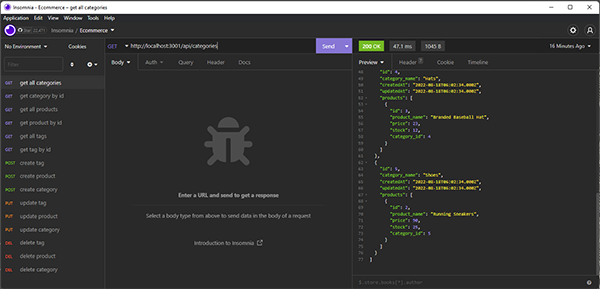

  
  # eCommServer
  
  ## Table of Contents
  * [Description](#description)
  * [Technologies](#technologies)
  * [Installation](#installation)
  * [Usage](#usage)
  * [Contributing](#contributing)
  * [Guidelines](#guidelines)
  * [Tests](#tests)
  * [License](#license)
  * [Questions](#questions)
---

  ## Description
  This is the back end server for an e-Commerce website. Configured endpoints for the server using express.js and uses sequelize to talk to the site's database on the backend, to be able to retrieve all products, categories and tags as a whole and individually, and create, update and delete the relevant items in the database. You can view a demonstration of the functionality [here](https://drive.google.com/file/d/1bMHmhgoEOasy-vn-zCpnMp2ROC2BvCbk/view).

  

  ## Technologies
  * MySQL
  * node.js
      * express
      * sequelize

  ## Installation
   Clone the repo, npm install

  ## Usage
   Use schema.sql to create the database and npm run seed to populate tables

  ## Contributing
   If you'd like to contribute reach out via the email below

  ## Guidelines
   Use a program like insomnia for functionality.

  ## Tests
   Tests run in development.

  ## License
   Licensed under [MIT](https://opensource.org/licenses/MIT) 

   ---

  ## Questions
   For any questions you can find me at [GitHub](https://github.com/mleftwich) or email me at [mleftwich@live.com](mailto:mleftwich@live.com) 
